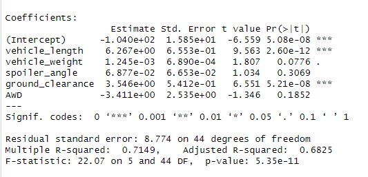
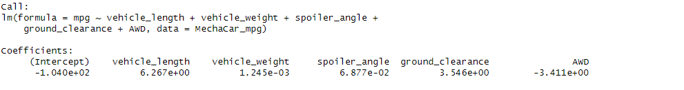
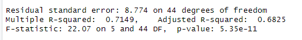
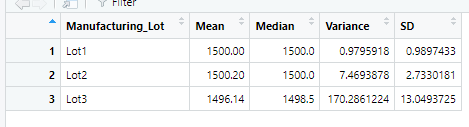
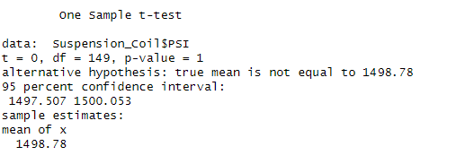
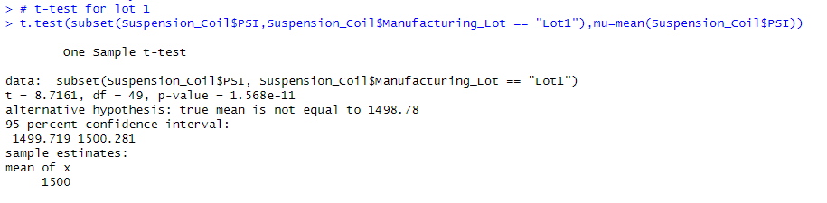
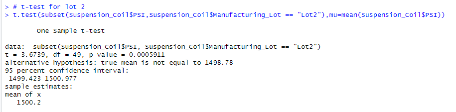
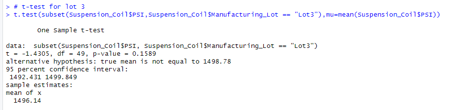

# MechaCar_Statistical_Analysis
Using statistical analysis to help production issues for AutosRUs

## Deliverable 1: Linear Regression to Predict MPG

### 1.Statistical Significance
Using a 95% confidence level we can determine that three of the variables were statistically significant - having non-random amount of variance to the mpg balues in the dataset.

Vehicle_length, vehicle_weight, and ground_clearance all show p-values less that .05 and therefore are statistically significant for prediction of mpg. 

### 2.Slope of the Linear Model
When we examine the slope of the linear model we can see that none of the slopes of variables are shown to be zero.

While vehicle_weight is approaching zero the rest show no doubt of being shown to be non-zero.

### 3.Effectiveness of the Linear Model in Prediction
The multi R-squared for the model is .7149, with the adjusted R-squared being 0.6825. Both of these are very good indicators for the validity of prediction. This model should be effective. There are other consideration that should be made before using this model exclusively and more data should be examined.

## Deliverable 2: Summary Statistics on Suspension Coils

### Total Summary
Here we can see the summary statistics for all the of the manufacturing lots. 

### Summary by Lot Number
When we split the data into lot numbers we get the following summary statistics.

When we examine the variance of the total manufacturing lot we see that the variance is less than 100. Which means that this manufacturing should pass inspection. However when we split the summary statistics into the three individual lots we can see that Lot 3 has significantly higher variance than Lot 1 and Lot 2, and is above the accepted variance at 170.2. This lot should be taken out of manufacturing and examined to find the source of the variace. Lot 3 should not be put into the manufacturing line.

## Deliverable 3: T-Tests on Suspension Coils

### T-Test on All Lots

### T-Test Lot 1

### T-Test Lot 2

### T-Test Lot 3

